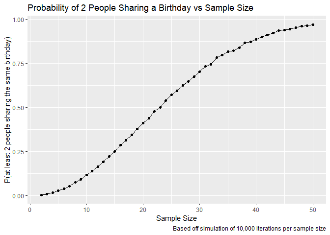

hw5
================
Adeena Moghni
2024-11-10

## Problem 1

``` r
birthday_sim = function(n){
  birthday_date <- sample(1:365, n, replace = TRUE) 
  length(birthday_date) != length(unique(birthday_date))
}
```

``` r
sim_results_df = 
  expand_grid(
    sample_size = 2:50,
    iter = 1:1000
  ) %>% 
  mutate(
    birthday_sim_df = map(sample_size, birthday_sim)
  ) %>% 
  unnest(birthday_sim_df) %>% 
  group_by(sample_size) %>% 
  summarize(
    total = sum(birthday_sim_df),
    probability = total/10000)

ggplot(sim_results_df, aes(x = sample_size, y = probability)) +
  geom_point() + geom_line() +
  labs(x = "Sample Size", 
       y = "P(at least 2 people sharing the same birthday)",
       title = "Probability of 2 People Sharing a Birthday vs Sample Size",
       caption = "Based off simulation of 10,000"
       )
```

<!-- -->

## Problem 2

``` r
power_sim = function(sample_mu){
    x = rnorm(n = 30, mean = sample_mu, sd = 5)
    t_test_result= t.test(x, mu = 0, conf.level = .95)
    tibble(xbar = mean(x), 
           p_value = t_test_result$p.value)
}

mu_0 = power_sim(sample_mu = 0)
print(mu_0)
```

    ## # A tibble: 1 × 2
    ##    xbar p_value
    ##   <dbl>   <dbl>
    ## 1 0.411   0.684

``` r
simulation_results_df = 
  expand_grid(
    sample_mu = c(1, 2, 3, 4, 5, 6),
    iter = 1:5000
  ) %>% 
  group_by(sample_mu) %>%
  mutate(
    power_sim_df = map(sample_mu, power_sim)
  ) %>% 
  unnest(power_sim_df)
```

``` r
power_graphing_df = 
  simulation_results_df %>% 
  group_by(sample_mu) %>% 
  summarize(
    total = sum(p_value < .05),
    proportion = total/5000)

ggplot(power_graphing_df, aes(x = sample_mu, y = proportion)) +
  geom_point() + geom_line() +
  labs(x = "True Average", 
       y = "Power",
       title = "Effect Size vs Power"
       )
```

<!-- -->

``` r
xbar_df = 
  simulation_results_df %>% 
  group_by(sample_mu) %>%
  summarize(
    avg_all_xbar = mean(xbar)
  )

xbar_reject_df = 
  simulation_results_df %>%
  filter(p_value < .05) %>% 
  group_by(sample_mu) %>%
  summarize(
    avg_rejected_xbar = mean(xbar)
  )

xbar_graphing_df = 
  left_join(
    xbar_df,
    xbar_reject_df,
    by = "sample_mu"
  ) %>% 
  pivot_longer(
    cols = avg_all_xbar:avg_rejected_xbar, 
    names_to = "classification", 
    values_to = "average_xbar")

ggplot(xbar_graphing_df, aes(x = sample_mu, y = average_xbar, color = classification)) +
  geom_point() + geom_line() +
  labs(x = "True Average", 
       y = "Average Sample Average",
       title = "Sample vs True Average"
       )
```

<!-- -->

## Problem 3

``` r
homicide_df = 
  read_csv(file = "./homicide-data.csv", na = c("NA", ".", "")) %>%
  janitor::clean_names() %>% 
  distinct() %>% 
  mutate(
    city_state = paste(city, ",", state),
    status = ifelse(disposition %in% c("Closed without arrest", "Open/No arrest"), 
                    "Unsolved", 
                    "Solved"))
```

    ## Rows: 52179 Columns: 12
    ## ── Column specification ────────────────────────────────────────────────────────
    ## Delimiter: ","
    ## chr (9): uid, victim_last, victim_first, victim_race, victim_age, victim_sex...
    ## dbl (3): reported_date, lat, lon
    ## 
    ## ℹ Use `spec()` to retrieve the full column specification for this data.
    ## ℹ Specify the column types or set `show_col_types = FALSE` to quiet this message.

``` r
totals_df = 
  homicide_df %>% 
  group_by(city) %>% 
  summarize(
    homicides_total = n(),
    homicides_unsolved = sum(status == "Unsolved")
  )

unsolved_baltimore = 
  totals_df %>% 
  filter(city == "Baltimore")

balt_result = 
  prop.test(x = unsolved_baltimore %>% pull(homicides_unsolved), 
            n = unsolved_baltimore %>% pull(homicides_total)) %>% 
  broom::tidy() %>% 
  mutate(
    p_hat = estimate,
    lower_ci_limit = conf.low,
    upper_ci_limit = conf.high
  ) %>% 
  select(p_hat, lower_ci_limit, upper_ci_limit)
```

``` r
results_df = 
  totals_df %>% 
  mutate(
    prop_test = purrr::map2(homicides_unsolved, homicides_total, ~ prop.test(x = .x, n = .y))
  ) %>% 
  mutate(results = map(prop_test, broom::tidy)) %>% 
  unnest(results) %>% 
  mutate(
    p_hat = estimate,
    lower_ci_limit = conf.low,
    upper_ci_limit = conf.high
  ) %>% 
  select(city, p_hat, lower_ci_limit, upper_ci_limit) %>% 
  mutate(city = fct_reorder(city, p_hat))

ggplot(results_df, aes(x = city, y = p_hat)) +
  geom_point() + 
  geom_errorbar(aes(ymin = lower_ci_limit, ymax = upper_ci_limit)) +
  theme(axis.text.x = element_text(angle = 90, hjust = 1)) +
  labs(x = "city", 
       y = "Sample Proportion (p hat)",
       title = "Proportion of Unsolved Homicides by City",
       caption = "Sample proportions with 95% confidence interval shown"
       )
```

<!-- -->
