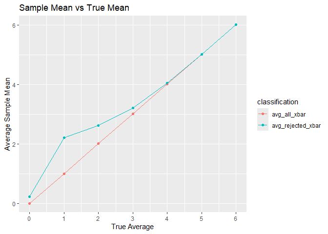

hw5
================
Adeena Moghni
2024-11-10

## Problem 1

``` r
birthday_sim = function(n){
  birthday_date <- sample(1:365, n, replace = TRUE) 
  length(birthday_date) != length(unique(birthday_date))
}
```

``` r
sim_results_df = 
  expand_grid(
    sample_size = 2:50,
    iter = 1:1000
  ) %>% 
  mutate(
    birthday_sim_df = map(sample_size, birthday_sim)
  ) %>% 
  unnest(birthday_sim_df) %>% 
  group_by(sample_size) %>% 
  summarize(
    total = sum(birthday_sim_df),
    probability = total/10000)

ggplot(sim_results_df, aes(x = sample_size, y = probability)) +
  geom_point() + geom_line() +
  labs(x = "Sample Size", 
       y = "P(at least 2 people sharing the same birthday)",
       title = "Probability of 2 People Sharing a Birthday vs Sample Size",
       caption = "Based off simulation of 10,000"
       )
```

<!-- -->

## Problem 2

``` r
power_sim = function(sample_mu){
  sim_data = tibble(
    x = rnorm(n = 30, mean = sample_mu, sd = 5),
  )
  sim_data %>% 
    summarize(
       t_test_results= broom::tidy(t.test(x, mu = 0, conf.level = .95)),
       xbar = mean(x),
       p_value = t_test_results$p.value
    ) %>% 
    select(xbar, p_value)
}
```

``` r
simulation_results_df = 
  expand_grid(
    sample_mu = c(0,1,2,3,4,5,6),
    iter = 1:5000
  ) %>%  
  mutate( 
    power_sim_df = map(sample_mu, power_sim)
  ) %>%  
  unnest(power_sim_df)
```

``` r
power_graphing_df = 
  simulation_results_df %>% 
  group_by(sample_mu) %>% 
  summarize(
    total = sum(p_value < .05),
    proportion = total/5000)

ggplot(power_graphing_df, aes(x = sample_mu, y = proportion)) +
  geom_point() + geom_line() +
  labs(x = "True Average", 
       y = "Power",
       title = "Effect Size vs Power"
       )
```

<!-- -->

``` r
xbar_df = 
  simulation_results_df %>% 
  group_by(sample_mu) %>%
  summarize(
    avg_all_xbar = mean(xbar)
  )

xbar_reject_df = 
  simulation_results_df %>%
  filter(p_value < .05) %>% 
  group_by(sample_mu) %>%
  summarize(
    avg_rejected_xbar = mean(xbar)
  )

xbar_graphing_df = 
  left_join(
    xbar_df,
    xbar_reject_df,
    by = "sample_mu"
  ) %>% 
  pivot_longer(
    cols = avg_all_xbar:avg_rejected_xbar, 
    names_to = "classification", 
    values_to = "average_xbar")

ggplot(xbar_graphing_df, aes(x = sample_mu, y = average_xbar, color = classification)) +
  geom_point() + geom_line() +
  labs(x = "True Average", 
       y = "Average Sample Average",
       title = "Sample vs True Average"
       )
```

<!-- -->
